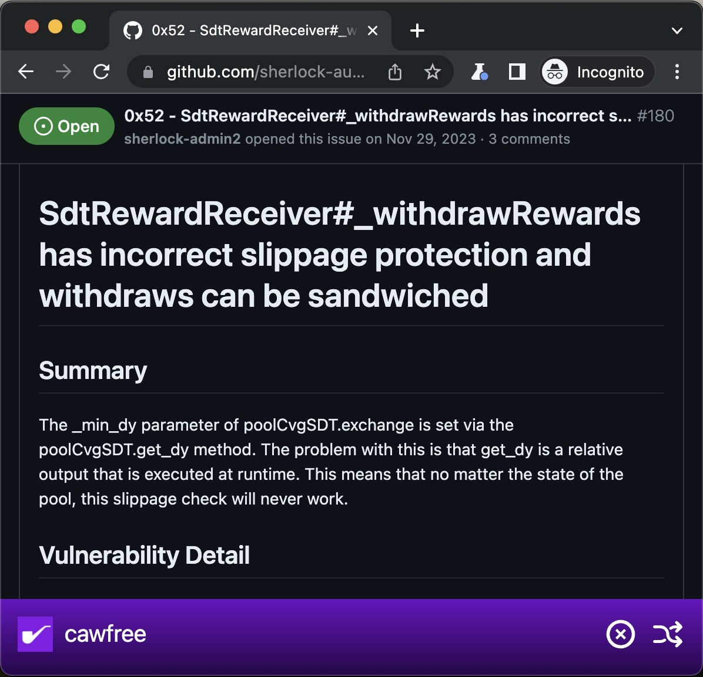

# Mycroft

[__Mycroft__](https://github.com/cawfree/Mycroft) is a self-populating flashcard deck designed to help [__watsons__](https://audits.sherlock.xyz/leaderboard) study.

It detects the contests that a watson has participated in and randomizes through the issues raised in each contest, to help improve learning through repetition. Over time, this will aid you to become increasingly familiar with the root causes,  ways of thinking and subtle implementation flaws you'd missed for a previous audit - and make sure you don't miss it the next time.

<div>
  
</div>

### 🤔 What does it do?

Quite little - in fact, just enough to be _barely_ useful.

But it does make it a lot easier for you to revisit contests where you have context to understand the issues raised and try to test your memory.

- 🕵️‍♀️ Browse the issues raised in contests for other watsons.
- 🔀 Shuffle through issues.
- 🚫 Ignore issues you don't want to see again.

## ✏️ Usage

You'll need to have [__Google Chrome__](https://blog.google/products/chrome/) installed, since this relies upon [`puppeteer`](https://github.com/puppeteer/puppeteer) for both web-scraping and rendering.

Once that's done, you can initialize the project like so:

```shell
git clone https://github.com/cawfree/Mycroft
cd Mycroft
yarn
```

To prepare a deck of contest issues for a given `$AUDITOR_NAME`, you can use:

```shell
yarn start $AUDITOR_NAME
```

That should be everything! 

## ✌️ License
[__CC0-1.0__](LICENSE.md)
